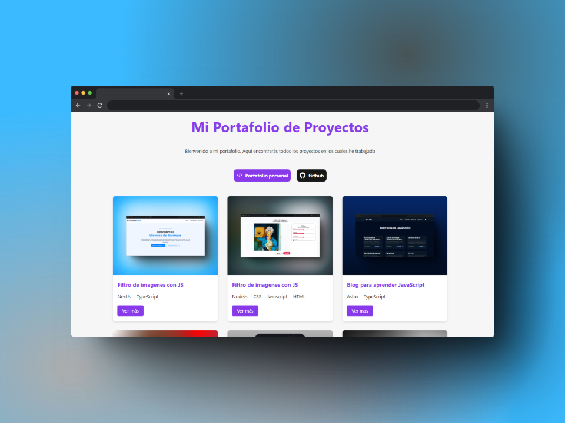

# Portafolio de Proyectos de Orlando Télrez

¡Bienvenido/a a mi portafolio de proyectos! Este sitio web está construido con Astro y muestra una colección de mis trabajos de desarrollo web con demostraciones en vivo y detalles técnicos.

 

## 🚀 Características Principales

- **Galería de proyectos** con tarjetas interactivas
- **Páginas individuales** para cada proyecto con detalles técnicos
- Diseño **100% responsive** y optimizado para móviles
- Generación estática de contenido
- Animaciones y transiciones suaves
- Integración con GitHub para mostrar repositorios
- Búsqueda semántica y SEO optimizado

## 📦 Instalación y Uso

1. Clona el repositorio:
```bash
git clone https://github.com/OrlandoTellez/portafolio-proyectos.git
```

2. Instala dependencias:
```bash
npm install
```

3. Inicia el servidor de desarrollo:
```bash
npm run dev
```

4. Abre en tu navegador:
```
http://localhost:4321
```

Comandos disponibles:
| Comando           | Acción                                  |
|-------------------|-----------------------------------------|
| `npm run dev`     | Inicia servidor de desarrollo           |
| `npm run build`   | Genera versión de producción            |
| `npm run preview` | Previsualiza build localmente           |

## 🗂 Estructura del Proyecto

```
orlandotellez-portafolio-proyectos/
├── public/            # Archivos estáticos
│   └── img/           # Imágenes de proyectos
├── src/
│   ├── components/    # Componentes reutilizables
│   ├── layouts/       # Plantillas de página
│   ├── pages/         # Rutas de la aplicación
│   └── api/           # Endpoint de proyectos
└── ...                # Configuraciones
```

## 📂 Manejo de Proyectos

Los proyectos se gestionan mediante el archivo:
`src/pages/api/proyectos.json.ts`

**Estructura de un proyecto:**
```typescript
{
  id: string,
  title: string,
  description: string,
  image: string,
  technologies: string[],
  demoUrl: string,
  githubUrl: string
}
```

Para añadir un nuevo proyecto:
1. Agrega una nueva entrada al array `projects`
2. Coloca las imágenes en `public/img/`
3. ¡Listo! La página se regenerará automáticamente

## 🛠 Tecnologías Utilizadas

- **Astro** - Generador de sitios estáticos
- **TypeScript** - Tipado estático
- **CSS Moderno** - Variables personalizadas, Grid y Flexbox
- **HTML Semántico** - Accesibilidad y SEO

## 🌐 Despliegue

El sitio está optimizado para despliegue en plataformas como:
- Vercel
- Netlify
- GitHub Pages
- Railway

Configuración recomendada:
- Build Command: `npm run build`
- Output Directory: `dist`

## 📄 Licencia

Este proyecto está bajo licencia MIT. Consulta el archivo [LICENSE](LICENSE) para más detalles.

---

👨💻 **Desarrollado por Orlando Téllez**  
💼 [Portafolio Personal](https://portafolio-orlando-tellez-ot.vercel.app/) | 🐱 [GitHub](https://github.com/OrlandoTellez)